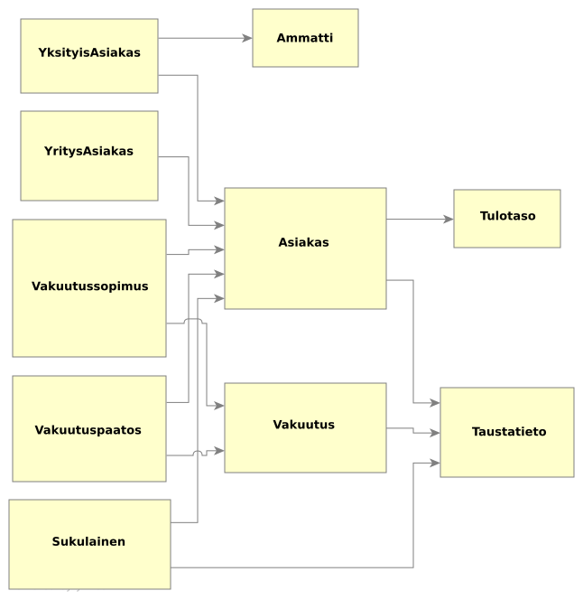
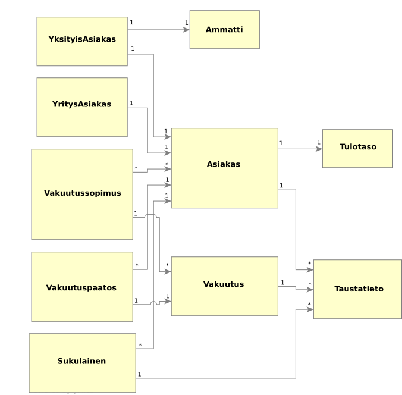
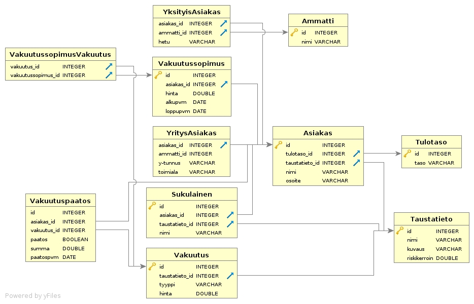

# Tietokantojen perusteet, suunnittelutehtävä: Vakuutusyhtiö VakaVan tietokannan suunnittelu

Aki Rehn (xxx)
Atte Lainejoki (xxx)
Heino Pitkänen (xxx)

<div style="page-break-after: always;"></div><!-- page break -->

## 1. Käsiteanalyysin vaiheet

Käsiteanalyysi suoritettiin viidessä vaihessa.

Raportissa kuvataan jokaista vaihetta ainakin pintapuolisesti.

### 1.1 Käsite-ehdokkaiden tunnistaminen

Ensimmäisessä vaiheessa pyrittiin tunnistamaan ongelmankuvauksesta erilaisia substantiiveja ja ilmiöitä, jotka valittiin käsite-ehdokkaiksi.

Ensimmäisessä vaiheessa tunnistettiin seuraavia käsite-ehdokkaita:

* vakuutusyhtiö
* paperiteollisuutta
* hallintopäällikkö
* yritysasiakas
* yksityisasiakas
* henkivakuutus
* kotivakuutus
* matkavakuutus
* sairausvakuutus
* lapsivakuutus
* autovakuutus
* tapaturmavakuutus
* oikeusturvavakuutus
* elakevakuutus
* yhdistelma
* asiakas
* hinnoittelu
* taustatieto
* vakuutusäätos
* asuinpaikka
* tulotaso
* työ
* harrastukset
* vakuutushistoria
* korvaukset
* lapsi
* sukulainen
* allergia
* sairaus
* vakuutus
* hinta
* harrastus
* alennus
* kokonaissumma
* laji
* riski
* vakuutuspäätös
* tieto
* raportti
* vakuutussopimus
* vakuutustyyppi
* kysyntä
* kannattavuus
* arkisto
* tulot
* menot
* vakuutuskorvaus
* kuukausi
* ammatti
* istumatyö

Käsitteistä karsiutui huomattava määrä pois. Kahden karsintakierroksen jälkeen jäljelle jäivät seuraavat käsite-ehdokkaat:

* yritysasiakas
* yksityisasiakas
* asiakas
* vakuutus
* vakuutussopimus
* vakuutuspäätös
* taustatieto
* asuinpaikka
* tulotaso
* harrastus
* vakuutushistoria
* sairaus
* lapsi
* sukulainen
* ammatti

### 1.2 Käsitteiden välisten yhteyksien tunnistaminen

Kuvauksesta nousee esille seuraavat yhteyksiä kuvaavat tekstit.

* tarjoamme monipuolisia vakuutuksia sekä yritys- että yksityisasiakkaille
* vakuutuksemme sisältävät muunmuassa henki-, koti-, matka-, sairaus-, lapsi-, auto-, tapaturma-, oikeusturva- ja eläkevakuutuksia, sekä niiden yhdistelmiä
* vakuutusten hinnoittelu on asiakaskohtaista
* hinnoittelussa vaikuttavat asiakkaiden taustatiedot
* Asiakkaan taustatiedoista vakuutuksen hinnoitteluun ja vakuutuspäätökseen vaikuttavat muun muassa asuinpaikka, tulotaso, työ, harrastukset, sekä tietenkin aiempi vakuutushistoria ja asiakkaalle maksetut korvaukset
* jos lapsella tai suvussa on tunnettuja allergioita tai muita sairauksia, vaikuttavat nämä luonnollisesti myös vakuutuksen hintaan
* vastaavasti tapaturma-alttiita lajeja harrastavien asiakkaiden tapaturmavakuutusten hinnoittelussa otetaan huomioon harrastusten riskit
* jos asiakas ottaa useita vakuutuksia kauttamme, tulee hänelle tarjota alennusta kokonaissummasta,
* jokaisen vakuutuspäätöksen yhteydessä tulee kerätä vakuutuspäätökseen liittyvät ja vaikuttavat tiedot yksityiskohtaisesti
* asiakkaiden ottamien vakuutusten määrät vaikuttavat hinnoitteluumme


Teksteistä voidaan päätellä seuraavat yhteydet.

* Vakuutukseen liittyy yritys- tai yksityisasiakkaita
* Vakuutukset koostuvat erilaisista vakuutustyypeistä
* Vakuutussopimus sisältää vakuutusten yhdistelmiä
* Vakuutuksen hinnoittelu on asiakaskohtaista
* Vakuutuksen hintaan vaikuttavat taustatiedot
* Vakuutuksen hintaan vaikuttaa vakuutushistoria
* Vakuutushistoria on monta asiakkaan vakuutuspäätöstä
* Vakuutuspäätökseen vaikuttaa vakuutushistoria
* Vakuutuspäätökseen vaikuttavat taustatiedot
* Vakuutuksen hintaan vaikuttavat sukulaisten sairaudet
* Vakuutuksen hintaan vaikuttavat harrastukset
* Vakuutuksen hintaan vaikuttaa vakuutusten määrä

Käsiteanalyysin toisessa va heessa päädyttiin seuraavanlaiseen kuvaan käsitteistä ja niiden välisistä yhteyksistä.




### 1.3 Tunnista ja määrittele osallistumisrajoitteet

* Asiakkaalla on monta vakuutusopimusta, joista yksi on voimassa
* Asiakkaalla on taustatietoja
* Yksityisasiakkaalla on ammatti
* Yksityisasiakkaalla on sukulaisia
* Vakuutuspäätös liittyy vakuutukseen
* Vakuutushistoriassa on monta vakuutuspäätöstä
* Vakuutussopimus sisältää monta vakuutusopimusta
* Vakuutukseen liittyy taustatietoja (riskitekijöitä)

Lisäämällä havaitut osallistumisrajoitteet päädyttiin seuraavanlaiseen käsitekaavioon.




### 1.4 Tunnista attribuutit ja lisää ne käsitteille

Seuraavassa vaiheessa tekstistä etsittiin attribuutteja löydetyille käsitteille. Tunnistettiin seuraavat attribuutit:

* yritysasiakas
  * y-tunnus
  * toimiala


* yksityisasiakas
  * hetu
  * ammatti


* vakuutus
   * tyyppi
   * hinta


* vakuutussopimus
   * voimassa
   * alkamisaika
   * loppumisaika
   * kokonaishinta


* vakuutuspäätös
  * vakuutus
  * korvaussumma
  * päätös


* ammatti
  * nimi


* taustatieto
  * kuvaus
  * riskikerroin


* asuinpaikka
  * kuvaus
  * riskikerroin


* tulotaso
  * taso


* harrastus
  * kuvaus
  * riskikerroin


* sairaus
  * kuvaus
  * riskikerroin


* sukulainen
  * nimi
  * sairaudet


* lapsi
  * nimi
  * sairaudet


* ammatti
  * nimi


Attribuuttien lisäämisen jälkeen alkaa käsitekaavio osallistumisrajoitteneen jo muistuttamaan tietokantakaaviota.


#### 1.5 Yleistä ja eriytä käsitteitä

Käsiteanalyysiä tehdessä havaittiin, että muutamat käsitteet ovat toisen käsitteen erikoistapauksia.

* Lapsi on sukulaisen erikoistapaus
* Yritysasiakas ja yksityisasiakas ovat asiakkaan erikoistapauksia
* Asuinpaikka, tulotaso, harrastus ja sairaus ovat taustatietojen erikoistapauksia
* Vakuutushistoria on käyttännössä vain lista asiakkaaseen liittyviä vakuutuspäätöksiä

Lopulliseksi käsite-listaksi saatiin siis seuraavat käsitteet:


* asiakas
* yritysasiakas
* yksityisasiakas
* vakuutus
* vakuutussopimus
* vakuutuspäätös
* ammatti
* taustatieto
* sukulainen


## 2. Tietokannan taulujen kuvaukset

Tietokanta on suunniteltu käsiteanalyysin pohjalta.

Käsiteanalyysissa havaituille käsitteille lisättiin löydetyt attribuutit. Esimerkiksi hinta kuvataan double -tyyppisenä, merkkijonot string -tyyppisenä, sekä päivämäärät date -tyyppisenä.

Lisäksi käsiteanalyysissä löydetyt osallistumisrajoitteet hyödynnettiin ja lisäämällä tietokantatauluille tarvittavat pää- ja viiteavaimet sekä luomalla tarvittavat liitostaulut.


## 3. Tietokantakaavio

Lopputulemana muodostettiin seuraavanlainen tietokantakaavio.




## 4. Kolmen tärkemmäin taulun SQL Create Table lauseet

Tärkeimmiksi taluluiksi valittiin tietokantamallin tauluista keskeisimpiä tauluja.

Asiakas.

```
CREATE TABLE Asiakas (
    id integer PRIMARY KEY,
    tulotaso_id integer,
    taustatieto_id integer,
    nimi varchar(50),
    hetu varchar(11),
    osoite varchar(200),
    FOREIGN KEY (taustatieto_id) REFERENCES Taustatieto (id),
    FOREIGN KEY (tulotaso_id) REFERENCES Tulotaso (id)
);
```

Vakuutussopimus, joka yhdistää asiakkaaseen liitetyt vakuutukset. Vakuutussopimukselle lasketaan kokonaishinta, jossa huomioidaan asiakkaalla olevat vakuutukset. Lisäksi sopimuksella on alku- ja loppupäivämäärä POSIX-muodossa.

```
CREATE TABLE Vakuutussopimus (
    id integer PRIMARY KEY,
    asiakas_id integer,
    tyyppi varchar(50),
    hinta double,
    alkupvm integer,
    loppupvm integer
    FOREIGN KEY (asiakas_id) REFERENCES Asiakas (id)
);
```

Vakuutuspäätös, joka kerää yhteen asiakkaalle myönnetyt (tai hylätyt) päätökset korvaushakemuksista.

Vakuutuspäätökset toimivat myös tietona asiakkaan vakuutushistoriasta.

```
CREATE TABLE Vakuutuspaatos (
    id integer PRIMARY KEY,
    asiakas_id integer,
    vakuutus_id integer,
    paatos boolean,
    summa double,
    FOREIGN KEY (asiakas_id) REFERENCES Asiakas,
    FOREIGN KEY (vakuutus_id) REFERENCES Vakuutus
);

```

## 5. Käyttötapauksia

Ongelmankuvauksen ja käsitteiden perusteella luotiin seuraavat käyttäjätarinat ja niille esimerkkitietokantakyselyt.

* Ylläpitäjä voi luoda uuden asiakkaan.

```
INSERT INTO Asiakas (nimi, hetu, osoite, tulotaso_id, taustatieto_id)
	VALUES ('Mikko Mallikas', '010170-123F', 'Mallikatu 1 B 12, 00100 Helsinki', 1, 3)
);
```

* Ylläpitäjä voi luoda uuden vakuutussopimuksen.

```
INSERT INTO Vakuutussopimus (tyyppi, hinta, alkupvm, loppupvm, asiakas_id)
	VALUES ('peruspaketti', 70.50, 1507579376, NULL, 1)

INSERT INTO VakuutussopimusVakuutus (vakuutus_id, vakuutussopimus_id)
	VALUES (2, 1), (3, 1), (4, 1)
```

* Ylläpitäjä voi luoda uuden vakuutuspäätöksen.

```
INSERT INTO Vakuutuspaatos (paatos, summa, asiakas_id, vakuutus_id)
	VALUES (true, 368.50, 1, 2)
```

* Ylläpitäjä voi etsiä yksittäisen vakuutuksen aiheuttamat tulot.

```
SELECT SUM(hinta) FROM Vakuutus
	WHERE id = 1
```

* Ylläpitäjä voi etsiä maksetut korvaukset vakuutuskohtaisesti. (menot)

```
SELECT SUM(summa) FROM Vakuutuspaatos
	WHERE vakuutus_id = 1
```

* Ylläpitäjä voi tarkistaa voimassaolevat vakuutussopimukset.

```
SELECT * FROM Vakuutussopimus
	WHERE loppupvm IS null
```

* Ylläpitäjä voi tarkistaa vakuutuksiin liittyvien vakuutussopimusten määrän. (kysyntä)

```
SELECT COUNT(*) FROM VakuutussopimusVakuutus
	WHERE vakuutus_id = 1
```

* Ylläpitäjä voi tarkistaa tiettyyn ammattiin liittyvät sairaudet.

```
SELECT Taustatieto.nimi AS sairaus, Taustatieto.riskikerroin AS riskikerroin, Ammatti.nimi AS ammatti
	FROM Ammatti
	INNER JOIN YksityisAsiakas ON Ammatti.id = YksityisAsiakas.ammatti_id
	INNER JOIN Asiakas ON YksityisAsiakas.asiakas_id = Asiakas.id
	INNER JOIN Taustatieto ON Asiakas.taustatieto_id = Taustatieto.id
	WHERE Taustatieto.nimi = 'selkäkipu'
```

* Ylläpitäjä voi tarkistaa tiettyyn sairauteen liittyvät menot.

```
SELECT SUM(Vakuutuspaatos.summa)
	FROM Taustatieto
	INNER JOIN Vakuutus ON Taustatieto.id = Vakuutus.taustatieto_id
	INNER JOIN Vakuutuspaatos ON Vakuutus.id = Vakuutuspaatos.vakuutus_id
```

## 6. Ratkaisussa havaitut ongelmat

Ratkaisun loppuvaiheessa, erityisesti asiakkaan kaipaamia käyttötapauksia rakennettaessa huomattiin muutamia mallissa muutamia ongelmia.

* Korvauhakemus tietokantataulu puuttuu, joten mallissa ei ole mahdolisuus tallettaa asiakkaan tekemiä korvauhakemuksia
* Yllä olevaan liittyen olisi ehkä kuvaavampi nimi Vakuutuspaatos -taululle ollut Korvauspäätös ja näin se loogisesti liittyisi Korvaushakemukseen
* Mallista ei saada selville asiakkaan toivomaa vakuutustyyppikohtaisia menoja ja tuloja, johtuen siitä että Vakuutussopimus talletetaan vain kokonaishinta alennuksineen. Korjausehdotuksena esitetään MyydytVakuutukset tietokantataulua, jonne lisätään Vakuutussopimuksiin kuuluvat vakuutukset alennettuine hintoineen


